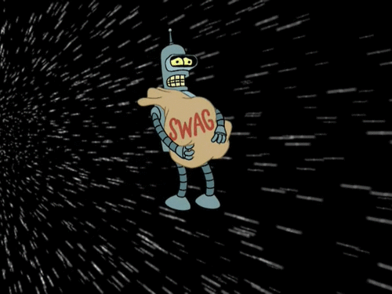
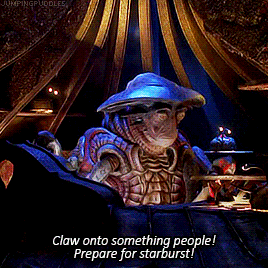

  

  <h3 align="center">LINK TO DEPLOYED APPLICATION: <h3>

<h1 align="center"> [live dployment link](https://half-price-galaxy-5da8f385ff20.herokuapp.com/) </h1>

# Table of Contents

- [Description](#description) 

- [Usage](#usage)

- [Technologies Used](#technologies-used)

- [Project Requirements](#project-requirements)

- [Examples of application](#examples-of-application)

## Description

Have you ever wanted to find a one stop shop for universe to universe goods?! Look no further! We have things ranging from "The Klorpian Mark 3" to experiences like "The Planetaira Package"! Our wide variety of Real Estate opportunities are good for any budget and any galaxy! The Splorgon ranges from 1 - 10+, which is a perfect opportunity for a starting intergalactic family or someone looking to move to the outer realms!

Take a chance, make a change, and breaaaaaak away from the norm of your home planet, (....especially humans)!

GIVE US A TRY AND PURCHASE SOMETHING TODAY! YOU KNNOW YOU WANT TO!

What is money called in space? ........ STAR BUCKS!

☠️☠️☠️☠️☠️☠️☠️☠️☠️☠️

 DISCLAIMER FOR HUMANS LEAVING EARTH: 

 Currently there is no form of currency on earth that can come close to the worth of additional currencies outside of the Milkyway. 

 **PLEASE BE AWARE - Humans will be required to pay for their initial voyage in the total of 1 adult human arm and leg totaling 2 organic limbs** 

 On reentry at your first arrival gate you can trade your one cybernetic credit for a replace arm and leg made of salvaged parts from sector 12378921732198

☠️☠️☠️☠️☠️☠️☠️☠️☠️☠️

## Usage

Public Repo link: https://github.com/ShannaRenee/Half-Price-Galaxy

<h2 align="center">Galactic Commerce Lifeform interface</h2>

On this lifeform interface we will be providing a space to buy, sell, trade, things that are “OUT OF THIS WORLD!!”
The three base categories that will be available for this will be:
- Real estate on any and all properties inside and outside of the Milky Way!
  - Examples:
    - 2 splorgons (acres) on Pluto
- Trips to and from various locations you’ve heard of and others you haven’t!
  - Examples:
    - Trip for two all the way to and from Decapod 10! (Zoidberg’s home planet)
- Miscellaneous category that provides availability to goods and wares from various life forms throughout any universe you can imagine….and then some!
  - Examples: 
    - The Klorpian Mark 3! With all the bells and whistles you can think of! (LITERALLY!)

## Technologies used

I ended up using quite a few different things!

- React
- GraphQL
- Node.js
- Express.js
- MongoDB 
- MongooseODM
- Heroku
- JWT Authentication
- Bootstrap

## Credit

Team Githubs

Shanna Morris: https://github.com/ShannaRenee

Daniel Pacheco: https://github.com/Daniel-0117

Larissa Stack: https://github.com/RissaStack

Ismael Jimenez: https://github.com/Idjjurado

## License

MIT License (see repo)

## Project Requirements
With your group, you’ll again conceive and execute a design that solves a real-world problem. In creating your first collaborative MERN-stack single-page application, you’ll combine a scalable MongoDB back end, a GraphQL API, and an Express.js and Node.js server with a React front end, implementing user authentication with JWT to build a user-focused platform. You’ll continue to build on the agile development methodologies you’ve used throughout this course. These include storing your project code in GitHub, managing your work with a project management tool, and implementing feature and bug fixes using the Git branch workflow and pull requests.

For this project, you should start from scratch. Doing so will allow you to revisit your front-end abilities in the context of React and solidify your understanding of working with multiple servers in a MERN application. Your skills have continued to improve since the first two projects, so naturally your approach will be different considering the experience you’ve gained with each new application you’ve built.

Your group will use everything you’ve learned throughout this course to create a MERN-stack single-page application that works with real-world data to solve a real-world challenge, with a focus on data and user demand. This project will provide you with the best opportunity to demonstrate your problem-solving skills, which employers will want to observe. Once again, the user story and acceptance criteria will depend on the project that you create, but your project must fulfill the following requirements:

- Use React for the front end.

- Use GraphQL with a Node.js and Express.js server.

- Use MongoDB and the Mongoose ODM for the database.

- Use queries and mutations for retrieving, adding, updating, and deleting data.

- Be deployed using Heroku (with data).

- Have a polished UI.

- Be responsive.

- Be interactive (i.e., accept and respond to user input).

- Include authentication (JWT).

- Protect sensitive API key information on the server.

- Have a clean repository that meets quality coding standards (file structure, naming conventions, best practices for class and id naming conventions, indentation, high-quality comments, and so on).

- Have a high-quality README (with unique name, description, technologies used, screenshot, and link to deployed application).

## Examples

Here is an example screenshot of the Book Search Engine using GoogleBooks API!!

  

